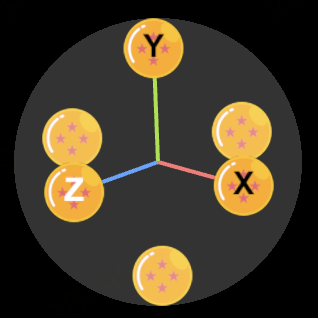

# 3D Navigator Gizmo

A 3D navigator gizmo addon for ThreeJS. It has features of both `TrackballControls` and `ViewHelper`. It does not lock the camera to the direction vertical to up when the camera is moved to the direction parallel to up.




# Install

```
npm i threejs-navigator-gizmo
```

# Usage

```javascript
const navigator = new NavigatorGizmo(camera, renderer, { ... })

...
const render = () => {
	renderer.render(scene, camera)
	navigator.update()
}

...
```

# Options

| Property | Description | Type | DefaultValue|
| --- | --- | --- | -- |
| size |  Viewport size of gizmo | `number` | `200` |
| rotateSpeed | Rotation speed | `number` | `1` |
| paddingX | Horizontal distance from the left edge of canvas | `number` | `0` |
| paddingY | Horizontal distance from the bottom edge of canvas | `number` | `0` |
| navigatorBgColor | Color of circular background of navigator  | `number` | `0xffffff` |
| navigatorBgOpacity | Opacity of circular background of navigator  | `number` | `0.2` |
| pinterLockMode | Whether to enable pointer lock mode. Mouse pointer will be hidden when dragging will if enabled. |  `boolean` | `false` |
| trackballTextColor | Text color of trackball | `number` | `0x000000` |
| trackballTextHoverColor | Text color of trackball if hover | `number` | `0xffffff` |
| trackballBgImage | Background image of trackball | `HTMLImageElement` | - |
